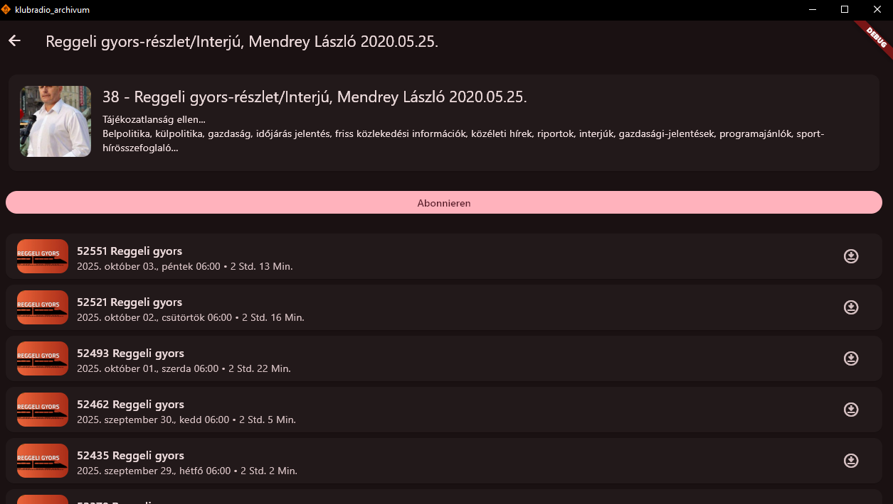

# Improve UI with this points

## Add player in the podcast-list

TODO-AI

[]  We are missing the Player on this page
[]  Autostart should be in settings able to disable.
[]  missing playlist editing
[]  clicking on a single episode, should not change the whole playlist. 
    Just add the episode to the end of the playlist.
[]  add "show playlist-button" between home and discover
